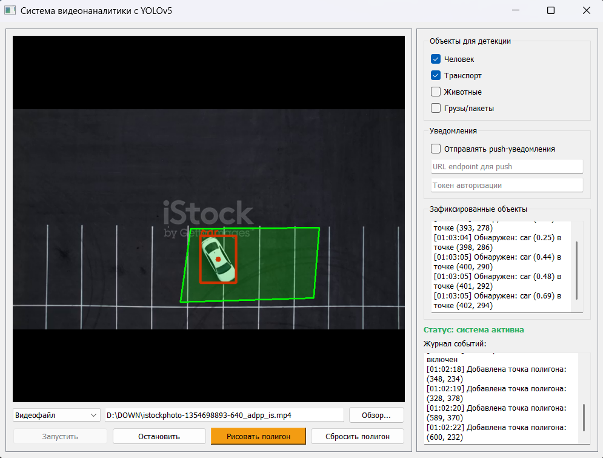

# Система видеонаналитики с YOLOv5



## Возможности работы с видео и кадрами

### 1. Расширенные функции обработки кадров
- **Выделение зоны интереса**:
  - Рисование полигона произвольной формы
  - Визуальное выделение объектов внутри зоны
  - Оповещение о зафиксированном обьекте

- **Фильтрация объектов**:
  - Выбор типов объектов для детекции (люди, транспорт, животные и др.)
  - Игнорирование мелких объектов (настраиваемый порог размера)

### 2. Работа с видеофайлами
- Поддержка форматов: MP4, AVI, MOV, MKV

### 3. Работа с RTSP потоками
- Поддержка стандартных RTSP потоков
- Автоматическое переподключение при обрыве связи
- Настройка буферизации для стабильной работы
- Адаптивное качество обработки при изменении битрейта

### 4. Дополнительные функции
- **Журналирование**:
  - Запись всех событий детекции
  - Фильтрация журнала по типу объектов

- **Уведомления**:
  - Push-уведомления через HTTP-запросы
  - Настройка условий срабатывания

## Установка и запуск

### Установка
```bash
git clone https://github.com/yourusername/video-analytics.git
cd video-analytics
pip install -r requirements.txt
```
### Запуск
```bash
python main.py
```
## Поддерживаемые модели YOLO
  - YOLOv5s (по умолчанию)
  - YOLOv5m
  - YOLOv5l
  - YOLOv5x
### Для использования других моделей замените строку загрузки модели в коде.

